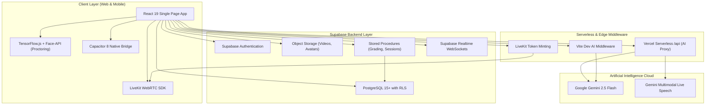
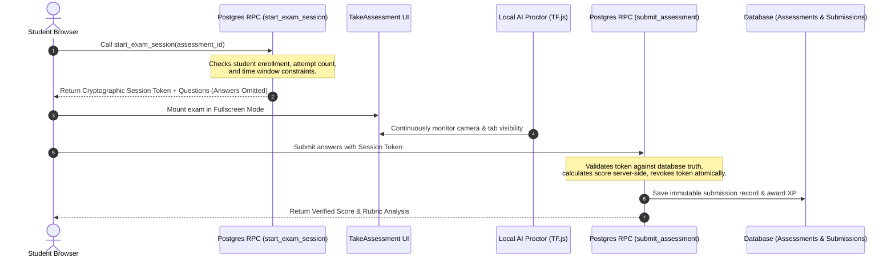

# 🎓 Learnova — Next-Generation Virtual Classroom & AI Learning Platform

[](https://react.dev/)
[](https://vite.dev/)
[](https://tailwindcss.com/)
[](https://supabase.com/)
[](https://livekit.io/)
[](https://deepmind.google/technologies/gemini/)
[](https://www.tensorflow.org/js)
[](https://capacitorjs.com/)
[](https://vitest.dev/)

**Learnova** is an enterprise-grade, full-stack educational platform and virtual classroom designed for schools, universities, coding bootcamps, and modern corporate training. Built on React 19, Supabase, and LiveKit, it seamlessly unites ultra-low-latency video classrooms, AI-driven proctoring, server-side tamper-proof assessment grading, multimodal AI mock interviews, interactive code sandboxes, gamification, and rich administrative analytics into one high-performance ecosystem.

---

## 📑 Table of Contents

- [Executive Summary](#-executive-summary)
- [System Architecture & Data Flow](#-system-architecture--data-flow)
- [Comprehensive Feature Matrix](#-comprehensive-feature-matrix)
  - [1. Student Learning Experience](#1-student-learning-experience)
  - [2. Interactive WebRTC Live Classroom](#2-interactive-webrtc-live-classroom)
  - [3. AI Mock Interview Suite](#3-ai-mock-interview-suite)
  - [4. Interactive Cheat Sheet & Sandbox System](#4-interactive-cheat-sheet--sandbox-system)
  - [5. Zero-Trust Assessment & AI Proctoring](#5-zero-trust-assessment--ai-proctoring)
  - [6. Continuous Schedule & Day Access Engine](#6-continuous-schedule--day-access-engine)
  - [7. Organizer & Administrator Suite](#7-organizer--administrator-suite)
  - [8. Gamification, XP & Leaderboard](#8-gamification-xp--leaderboard)
- [Role-Based Access Control (RBAC)](#-role-based-access-control-rbac)
- [Technology Stack](#-technology-stack)
- [Project Directory Structure](#-project-directory-structure)
- [Quick Start Guide](#-quick-start-guide)
  - [Prerequisites](#prerequisites)
  - [Installation & Setup](#installation--setup)
  - [Database Setup & Migrations](#database-setup--migrations)
  - [Running the App](#running-the-app)
- [Available NPM Scripts](#-available-npm-scripts)
- [Mobile PWA & Android App (Capacitor)](#-mobile-pwa--android-app-capacitor)
- [Security & Integrity Guardrails](#-security--integrity-guardrails)
- [Testing & Quality Assurance](#-testing--quality-assurance)
- [License & Credits](#-license--credits)

---

## 🚀 Executive Summary

Modern online education faces three primary challenges: **student disengagement**, **academic dishonesty during remote evaluations**, and **fragmented tooling** (using Zoom for classes, Google Forms for quizzes, LeetCode for practice, and Discord for chat).

Learnova resolves this by delivering a cohesive, browser-based operating system for education:
1. **Interactive Realtime Classroom**: HD WebRTC video, crystal-clear audio, dynamic screen sharing, and persistent classroom locking states.
2. **AI-Powered Proctoring**: Local, privacy-preserving computer vision detecting multi-face presence, face absence, and mobile phone usage without recording or streaming private webcams to servers.
3. **Fail-Closed Zero-Trust Grading**: Exam attempts are gated by server-generated cryptographic session tokens; answers are strictly evaluated in PostgreSQL via stored procedures (`SECURITY DEFINER`).
4. **Multimodal AI Mock Interviews**: Multilingual verbal voice interviews powered by Google Gemini Live STT, testing students with real-time technical questions and instant rubric evaluations.
5. **Continuous Progression**: 12-week continuous learning engine with strict sequential unlocking, 6:00 PM joining cutoff rules, and atomic coin early unlock mechanics.

---

## 🏗️ System Architecture & Data Flow



### Assessment Security & Grading Sequence



---

## 🌟 Comprehensive Feature Matrix

### 1. Student Learning Experience
- **Personalized Dashboard**: View study streak count, weekly goals, enrolled courses, upcoming live lectures, and daily curriculum focus.
- **Course Journey Timeline**: Visual roadmap tracking completed, in-progress, unlocked, and locked modules across all 12 weeks.
- **Distraction-Free Video Player**: High-definition video player supporting custom playback speeds, chapter navigation, lecture notes, downloadable lesson resources, and automatic completion progress calculation.
- **Floating AI Study Coach**: Powered by Google Gemini 2.5 Flash, providing contextual code explanations, concept clarification, and instant hints across the platform. Automatically docks/disables during live classes, tests, and mock interviews to maintain integrity.

### 2. Interactive WebRTC Live Classroom
- **Ultra-Low-Latency WebRTC**: Built on LiveKit Cloud for real-time video, audio, and screensharing with zero software installation required.
- **Jitsi Meet Fallback**: Zero-configuration embedded fallback option ensures classes never stall even if third-party credentials expire.
- **Classroom Controls**: Host mute/unmute, individual and group camera controls, chat messaging, hand-raising queue, and room locking.
- **Persistent Lock Sync**: Automatically synchronizes classroom lock state in Supabase so late-joining or rejoining students cannot bypass host restrictions.

### 3. AI Mock Interview Suite
- **Multimodal Voice Evaluation**: Students speak verbal responses; audio is transcribed in real-time via Gemini Live speech-to-text with English-only enforcement.
- **Organizer Question Bank**: Organizers can build custom question tracks (Frontend, Backend, System Design, Behavioral) with confidential ideal answers and scoring rubrics hidden from students via Row-Level Security (RLS).
- **Proctoring Enforcement**: Mandatory camera verification, full-screen lockdown, and automated 10-second silence auto-advance timers.
- **Detailed Performance Rubrics**: Instant scoring breakdown across Technical Accuracy, Communication Clarity, and Problem-Solving with tailored improvement tips.

### 4. Interactive Cheat Sheet & Sandbox System
- **Dual-Pane Live Runner**: In-browser HTML, CSS, and JavaScript editor with a secure sandboxed output preview pane.
- **Run-On-Demand**: Output rendering is delayed until the student clicks **"▶ Run Code"**, preventing unintended execution on load.
- **Multi-Question Interactive Quizzes**: Supports both Multiple Choice Questions (MCQ) and Write-Code questions with flexible whitespace and syntax normalization.
- **Anti-Cheat Solution Locks**: Clicking *"Show Answer"* permanently locks that question (0 XP awarded) while keeping subsequent questions accessible.
- **Zero-Data Leakage**: Organizer custom challenge tasks, difficulty levels, and helpful hints are fully dynamic; deleting them completely removes them without phantom fallbacks.

### 5. Zero-Trust Assessment & AI Proctoring
- **Client-Side Computer Vision**: Uses `@tensorflow-models/coco-ssd` and `@vladmandic/face-api` directly in the browser:
  - Detects absent face, multiple faces, and unauthorized devices (cell phones, tablets).
  - Emits real-time warnings with configurable violation thresholds.
- **Fullscreen Lockdown**: Enforces fullscreen mode with automatic blur and visibility-change detection on window/tab switching.
- **Server-Side Grading Gate**: Answers are never exposed in student network payloads. Submissions are graded directly in PostgreSQL via `submit_assessment_with_token`.

### 6. Continuous Schedule & Day Access Engine
- **12-Week Continuous Calendar**: Seamless curriculum progression mapping calendar dates to structured learning modules.
- **6:00 PM Joining Cutoff Rule**: Students joining before 6:00 PM on Day 1 receive immediate Day 1 access; students joining after 6:00 PM unlock Day 1 the following morning, ensuring balanced cohort cohorts.
- **Atomic Coin Early Unlock**: Students can exchange earned platform coins to unlock the next day's module ahead of schedule via atomic database transactions.
- **Sequential Active Focus**: Enforces sequential completion of current day modules before accessing subsequent days.

### 7. Organizer & Administrator Suite
- **Curriculum & Schedule Manager**: Create, schedule, reorder, and publish lectures, coding exercises, quizzes, and live classrooms.
- **Video & Asset Storage**: Directly upload high-definition video lessons and supplemental PDFs into Supabase Object Storage.
- **Live AI Proctoring Desk**: Real-time monitoring feed displaying student proctoring scores, violation logs, and snapshot audit trails.
- **Subscription & Renewal Operations**: Manage student access renewals, view expiring cohorts, and toggle grace period extensions.
- **Comprehensive Cheat Sheet Manager**: Rich section builder supporting text theory, code snippets, quizzes, values tables, and live playground challenges.

### 8. Gamification, XP & Leaderboard
- **XP Progression & Tier Badges**: Gain XP for completing lessons, passing quizzes, writing code, and maintaining daily streaks. Ranks progress from **Iron** (0 XP) to **Diamond** (7500+ XP).
- **Course-Scoped Leaderboards**: Ranks are strictly scoped to enrolled peers in the same course, fostering healthy competition.
- **Achievement Showcase**: Unlockable badges celebrate milestones (First Code Submission, 7-Day Streak, Perfect Assessment Score).

---

## 🛡️ Role-Based Access Control (RBAC)

Learnova enforces strict Role-Based Access Control across routes, components, and database rows:

| Feature / Resource | Student | Organizer | Sub Admin | Main Admin |
| :--- | :---: | :---: | :---: | :---: |
| Browse Enrolled Courses & Timeline | ✅ | ✅ | ✅ | ✅ |
| Take Assessments & Coding Practices | ✅ | ❌ | ❌ | ❌ |
| Attend AI Mock Interviews | ✅ | ❌ | ❌ | ❌ |
| View Course Leaderboard | ✅ (Enrolled) | ✅ | ✅ | ✅ |
| Host Live WebRTC Classroom | ❌ | ✅ | ✅ | ✅ |
| View Real-time AI Proctoring Logs | ❌ | ✅ | ✅ | ✅ |
| Create/Edit Courses & Curriculum | ❌ | ✅ (Owned) | ✅ | ✅ |
| Manage Question Banks & Rubrics | ❌ | ✅ | ✅ | ✅ |
| Manage Cheat Sheets & Sandboxes | ❌ | ✅ | ✅ | ✅ |
| Manage Student Renewals & Cohorts | ❌ | ✅ | ✅ | ✅ |
| System User & Role Administration | ❌ | ❌ | ❌ | ✅ |

---

## 💻 Technology Stack

| Domain | Stack & Packages | Purpose |
| :--- | :--- | :--- |
| **Frontend Framework** | `React 19.2`, `React Router v7` | Core UI architecture and navigation |
| **Build & Tooling** | `Vite 7.3`, `ESLint 9`, `Prettier` | Blazing fast HMR and optimized production bundles |
| **Styling & Icons** | `Tailwind CSS v4.2`, `Lucide React` | Utility-first responsive design and iconography |
| **3D & Animations** | `@splinetool/react-spline`, `Framer Motion` | Interactive 3D graphics and micro-interactions |
| **Realtime WebRTC** | `livekit-client`, `@livekit/components-react` | Real-time audio, video, and screen sharing |
| **Computer Vision AI**| `@tensorflow/tfjs`, `coco-ssd`, `face-api` | Client-side privacy-first proctoring detection |
| **Large Language Models**| `Google Gemini 2.5 Flash`, `Gemini Live STT` | AI Study Assistant and Mock Interview evaluations |
| **Backend as a Service**| `Supabase` (PostgreSQL, GoTrue Auth, Realtime) | Relational persistence, security rules, and auth |
| **Charts & Export** | `Recharts`, `jspdf`, `jspdf-autotable`, `html2canvas` | Analytics dashboards and printable PDF reports |
| **Mobile & Hybrid** | `@capacitor/core`, `@capacitor/android` | Native Android packaging and system bridge |
| **Unit & E2E Testing** | `Vitest`, `@testing-library/react`, `Playwright` | Robust automated test suites (107+ tests passed) |

---

## 📂 Project Directory Structure

```plaintext
Online-class-main/
├── android/                         # Native Android studio project (Capacitor)
├── api/                             # Vercel serverless functions (AI proxy, STT tokens)
│   ├── ai-proxy.js                  # Secure serverless Gemini proxy
│   └── get-stt-token.js             # Ephemeral speech-to-text token minting
├── deploy/                          # Production deployment scripts & configs
├── e2e/                             # Playwright end-to-end integration tests
├── public/                          # Static assets, PWA manifest, service worker
├── src/
│   ├── assets/                      # Brand logos, avatars, illustrations
│   ├── components/
│   │   ├── 3d/                      # Spline 3D interactive canvases
│   │   ├── cheatsheet/              # CodeBlock, Playground, Quiz, FontPreview
│   │   ├── live-classroom/          # LiveKit WebRTC controls, roster, and chat
│   │   ├── organizer/               # Proctoring desk, course managers, analytics cards
│   │   ├── student/                 # JourneyTimeline, AssessmentCards, InterviewDock
│   │   └── shared/                  # ProtectedViewer, SplitViewer, Modal, Toast
│   ├── constants/                   # XP rewards, roles, and status mappings
│   ├── contexts/                    # AuthContext, ThemeContext, MeetingContext
│   ├── hooks/                       # Custom hooks (useWeeklyCourse, useDeviceType, useXpAward)
│   ├── layouts/                     # StudentLayout, OrganizerLayout
│   ├── lib/                         # Supabase client and LiveKit helpers
│   ├── pages/
│   │   ├── auth/                    # Login, Register, Forgot Password
│   │   ├── organizer/               # 20+ Admin dashboards and management consoles
│   │   ├── student/                 # 16+ Student learning modules and exam runners
│   │   └── shared/                  # Universal pages (NotFound, Playground, Support)
│   ├── services/                    # API services (cheatSheetService, mockInterviewService)
│   ├── utils/                       # dayAccessEngine, sanitizeRichText, progressSync
│   ├── App.jsx                      # Route gateway and role-based guards
│   ├── main.jsx                     # Application bootstrap
│   └── index.css                    # CSS Design system tokens & animations
├── supabase/
│   ├── functions/                   # Deno Edge Functions
│   ├── migrations/                  # Incremental version-controlled SQL migrations
│   └── schema.sql                   # Base database schema, RPC functions, and RLS policies
├── capacitor.config.json            # Capacitor 8 native configuration
├── vite.config.js                   # Vite configuration with local AI development proxy
└── package.json                     # Project manifest and scripts
```

---

## 🚀 Quick Start Guide

### Prerequisites
- **Node.js**: `v20.x` or higher (`v22.x LTS` recommended)
- **npm**: `v10.x` or higher
- **Supabase Account**: With a new or existing PostgreSQL project
- **Google Gemini API Key**: Obtainable from [Google AI Studio](https://aistudio.google.com/)
- **LiveKit Cloud Account**: Obtainable from [LiveKit Cloud](https://cloud.livekit.io/)

### Installation & Setup

1. **Clone the repository:**
   ```bash
   git clone https://github.com/Dhanush386/Online-class.git
   cd Online-class-main
   ```

2. **Install project dependencies:**
   ```bash
   npm install
   ```

3. **Configure Environment Variables:**
   Create a `.env` file in the project root:
   ```bash
   cp .env.example .env
   ```
   Fill in your configuration:
   ```env
   # ── Supabase Credentials ──
   VITE_SUPABASE_URL=https://your-project-ref.supabase.co
   VITE_SUPABASE_ANON_KEY=your-anon-key-here

   # ── LiveKit WebRTC Configuration ──
   VITE_LIVEKIT_URL=wss://your-project.livekit.cloud
   VITE_LIVE_CLASS_PROVIDER=livekit

   # ── AI API Credentials ──
   # Used by local Vite middleware & serverless functions
   GEMINI_API_KEY=your-gemini-api-key-here
   VITE_GEMINI_API_KEY=your-gemini-api-key-here

   # ── Optional Push Notifications & OAuth ──
   VITE_VAPID_PUBLIC_KEY=your-vapid-public-key
   VITE_GOOGLE_CLIENT_ID=your-google-client-id
   ```

### Database Setup & Migrations

1. Open your Supabase project dashboard.
2. Go to the **SQL Editor**.
3. Execute the base schema from [`supabase/schema.sql`](supabase/schema.sql).
4. Run all sequential migration scripts in [`supabase/migrations/`](supabase/migrations/) in date order to apply recent security hardening, exam tokens, and cheat sheet RPCs.
5. Create the following public storage buckets under **Storage**:
   - `avatars` (Public)
   - `course-files` (Public or authenticated)
   - `recordings` (Authenticated)

### Running the App

Start the local development server:
```bash
npm run dev
```
Open your browser at `http://localhost:5173` to view the platform.

---

## 🛠️ Available NPM Scripts

| Command | Action |
| :--- | :--- |
| `npm run dev` | Starts Vite dev server with Hot Module Replacement (HMR) and AI server proxy |
| `npm run build` | Compiles and optimizes production assets into `/dist` (tested and verified) |
| `npm run preview` | Locally serves production bundle with security headers enabled |
| `npm run lint` | Analyzes code quality using ESLint 9 |
| `npm run format` | Formats all files with Prettier |
| `npm run test` | Runs the Vitest test suite (10 test suites, 107 tests) |
| `npm run test:watch` | Runs Vitest in interactive watch mode |
| `npm run test:e2e` | Runs Playwright browser integration tests |

---

## 📱 Mobile PWA & Android App (Capacitor)

Learnova is fully optimized for mobile devices and packages directly as an Android APK:

```bash
# 1. Build production web bundle
npm run build

# 2. Sync web bundle into native Android directory
npx cap sync android

# 3. Open project in Android Studio
npx cap open android
```

From Android Studio, click **Run 'app'** to launch on a physical device or Android Virtual Device (AVD).

---

## 🔐 Security & Integrity Guardrails

Learnova was audited and hardened with zero-trust principles:
1. **Server-Side Grading Gate**: Answers are never transmitted to the browser in quiz or exam payloads. Submissions are processed through Postgres stored procedures (`submit_assessment_with_token`).
2. **Session Token Invalidation**: Tokens are single-use; the database revokes the token in the same transaction as recording the student's submission.
3. **Client-Side Privacy Protection**: TensorFlow.js and Face-API run strictly inside client memory; webcam frames are analyzed locally and never uploaded to remote servers.
4. **Persistent Deletion Safeguards**: Deleted cheat sheets and curriculum items are recorded with client-side blacklisting (`learnova_cheatsheet_deleted_ids`) and Postgres RLS checks to prevent cache or seed resurrection.
5. **Iframe Sandboxing**: In-browser code playgrounds run with `sandbox="allow-scripts"` and strictly omit `allow-same-origin`, preventing student code from accessing localStorage or cookies.

---

## 🧪 Testing & Quality Assurance

The codebase includes exhaustive automated unit and integration tests covering:
- ✅ Password and OTP validation security
- ✅ Attendance tracking and classroom locking
- ✅ Assessment integrity and token validation
- ✅ 12-week continuous Day Access Engine and 6 PM cutoff rules
- ✅ XP progression, rank badges, and course completion sync
- ✅ Gemini Live Speech-to-Text and mock interview rubrics
- ✅ Interactive cheat sheet sandboxes, HTML escaping, and quiz locks

Run tests anytime using:
```bash
npm test -- --run
```

---

## 📄 License & Credits

- **Author**: [Dhanush](https://github.com/Dhanush386)
- **Repository**: [https://github.com/Dhanush386/Online-class](https://github.com/Dhanush386/Online-class)
- **License**: Proprietary and confidential. All rights reserved.